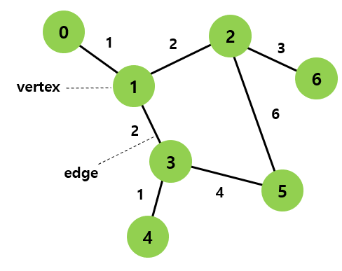
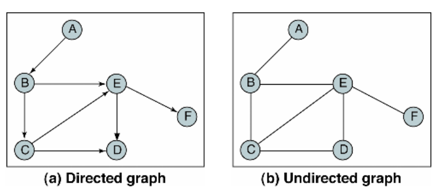
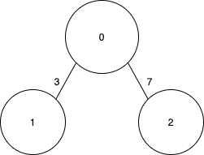
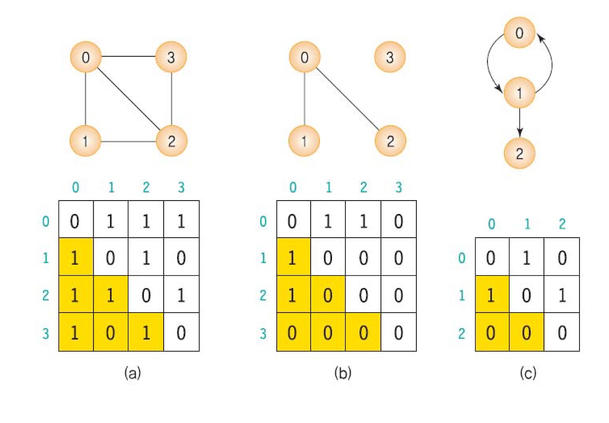
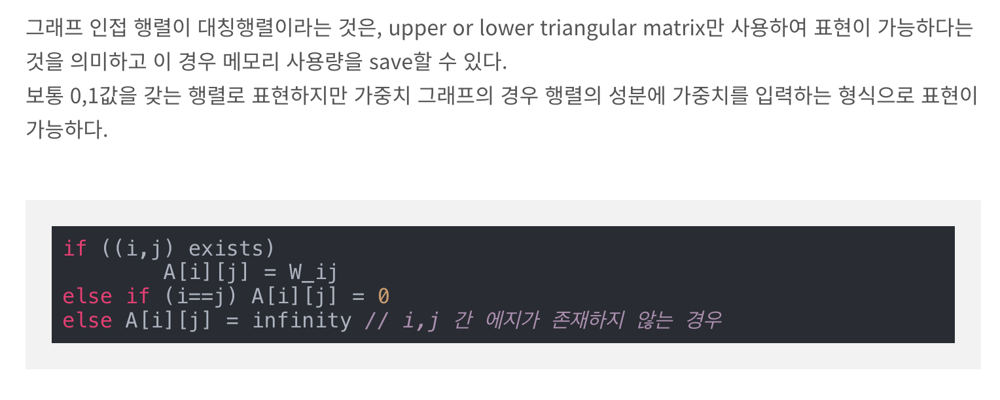
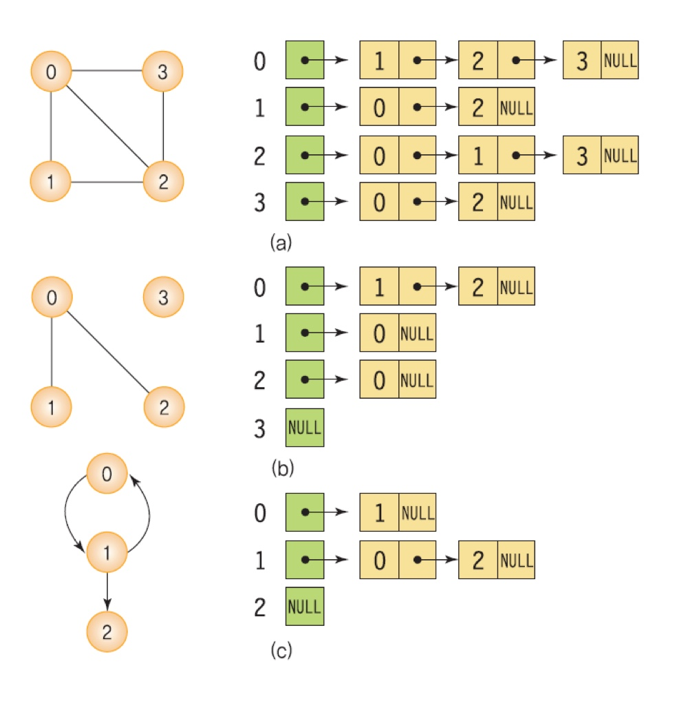
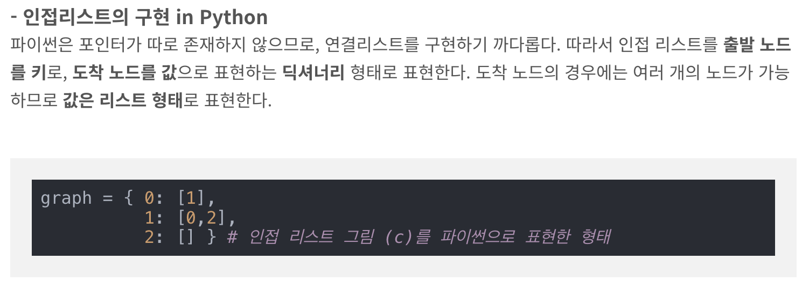

------------------------------------------------------------
# jungle_study
------------------------------------------------------------
### 3주차 공부 README
* 교재에 대한 공부와 공부 키워드에 따른 공부를 작성합니다.
------------------------------------------------------------
## 3주차 범위: ~1장 끝까지
### 책읽기

            
------------------------------------------------------------
## 3주차 범위: 그래프(vertex, edge, node, arc), BFS, DFS, 위상정렬

### 공부 키워드

* 그래프(vertex, edge, node, arc)
    - 정점(Vertex)과 그 정점을 연결하는 간선(Edge)으로 구성된다. 이러한 정점과 간선의 집합으로 이루어진 자료구조를 그래프라 함.
        - 간선(Edge): 무향 그래프에서 두 정점을 연결함. 방향성이 없기 때문에, 정점 A와 정점 B를 연결하는 간선은 "A - B"나 "B - A"로 동일하게 표현.
        - Arc: 유향 그래프에서 시작 정점에서 끝 정점까지의 방향성이 있는 연결선. 유향 그래프에서 두 정점을 연결한다. 방향성이 있어, 정점 A에서 정점 B로의 Arc와, 정점 B에서 정점 A로의 Arc는 다르게 취급한다. (네트워크 플로우, 작업 스케줄링, 방향성이 있는 관계를 모델링하는데 주로 사용함.)

        -  <-- 그림

    - 특징
        - 1. 방향성: 그래프는 방향성이 있을 수도 있고, 없을 수도 있다. 방향성이 있는 그래프를 "유향 그래프(Directed Graph)", 방향성이 없는 그래프(양방향이라는 것.)를 "무향 그래프(Undirected Graph)"
        - 2. 가중치: 간선의 길이 / 간선에 가중치가 할당되어 있을 수 있다. 이를 "가중 그래프(Weighted Graph)"
        - 3. 루프와 다중 간선: 그래프에는 자기 자신으로 돌아오는 루프나 두 정점 사이에 여러 간선이 있을 수 있음.
        - 4. 연결성: 모든 정점이 어떤 경로로든 연결되어 있으면 "연결 그래프(Connected Graph)"

        -  <-- 유향 / 방향 그래프

    - 사용하는 예
        - 1. 네트워크 디자인: 컴퓨터 네트워크, 전화 네트워크 등
        - 2. 경로 찾기: 지하철 노선도, 지도 앱
        - 3. 소셜 네트워크: 친구 관계, 팔로우 관계 등
        - 4. 탐색 알고리즘: 웹 크롤러, 검색 알고리즘
        - 5. 작업 스케줄링: 작업 간의 의존성 표현

    - 구현하는 방법
        - 라이브러리를 사용하거나, 리스트와 딕셔너리를 사용하여 구현.
        - 사용 라이브러리: networkx
        -  <-- 간단한 가중 그래프 예시

        - 두 표현방식은 시간복잡도, 공간복잡도의 측면에서 차이가 있으며. 노드의 개수를 N, 엣지의 개수를 E라고 할 때,

            - 인접행렬(Adjacency Matrix): 2차원 배열에 각 노드가 연결된 형태를 기록하는 방식. (파이썬이면 리스트 자료형을 사용)
                
                - 정점의 개수를 k라고 했을 때, k * k matrix를 정의함. 각 row는 해당 정점의 연결 상태를 의미하며, 공간 복잡도가 O(n^2)이기 때문에 희소 그래프인 경우 매우 비효율적.
                -  <-- 인접행렬
                -  <-- 구현방법

                - 특정 두 node 간의 edge 존재여부를 O(1)의 시간안에 찾을 수 있음. (2차원 matrix에 바로 접근하면 되기 때문) node의 차수는 O(N)안에 알 수 있는데, 전체 edge를 탐색할 경우 O(N^2)의 시간이 소요. 메모리의 측면에서 O(N^2)만큼의 메모리가 필요하기 때문에 node간에 edge가 존재하지 않는 메모리 공간이 낭비됨.

                - 그래프에 edge가 많이 존재하는 밀집 그래프(Dense graph)에서 유리
                    - 밀집 그래프(Dense graph)? : 간선의 개수가 정점의 개수에 비해 많은 그래프

            - 인접리스트(Adjacency List): Linked List(연결 리스트)라는 자료구조를 사용해서 그래프의 연결상태를 나타냄. (파이썬이면 기본 자료형인 리스트 자료형을 사용해서 Linked List의 기능을 표현할 수 있음.)

                - 각 정점에 인접한 정점들을 연결 리스트로 표현하는데, 정점이 n개인 그래프하면 n개의 연결리스트로 구현. 각 연결리스트마다 포인터 변수가 리스트의 처음 노드를 가리키며 연결리스트가 없는 경우, 차수가 0인 경우 포인터 변수의 값은 null이 된다.
                -  <-- 인접리스트
                -  <-- 구현방법
                
                - 특정 두 node 간의 연결 정보를 알기 위해 소요되는 시간은 해당 node에 연결된 edge의 개수에 따라 달라짐. 전체 edge를 탐색하는 경우 O(N+E)의 시간이 소요됨. 메모리의 경우, 각 node와 각 node에 연결된 edge를 표현해야 하므로 O(N+E)의 공간복잡도가 소요됨.

                - edge가 많이 없는 희소 그래프(Sparse graph)에서 유리
                    - 그래프(Sparse graph)? : 간선의 개수가 정점의 개수에 비해 매우 적은 그래프
    

* BFS

* DFS

* 위상정렬

------------------------------------------------------------
* 문제 풀어보기

------------------------------------------------------------