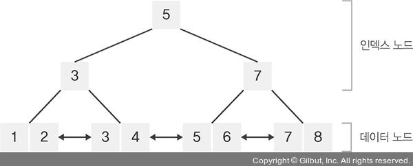

------------------------------------------------------------
# jungle_study
------------------------------------------------------------
### 3주차 공부 README
* 교재에 대한 공부와 공부 키워드에 따른 공부를 작성합니다.
------------------------------------------------------------
## 3주차 범위: ~1장 끝까지
### 책읽기

            
------------------------------------------------------------
## 3주차 범위: 그래프(vertex, edge, node, arc), BFS, DFS, 위상정렬

### 공부 키워드

* 그래프(vertex, edge, node, arc)
    - 정점(Vertex)과 그 정점을 연결하는 간선(Edge)으로 구성된다. 이러한 정점과 간선의 집합으로 이루어진 자료구조를 그래프라 함.
        - 간선(Edge): 무향 그래프에서 두 정점을 연결함. 방향성이 없기 때문에, 정점 A와 정점 B를 연결하는 간선은 "A - B"나 "B - A"로 동일하게 표현.
        - Arc: 유향 그래프에서 시작 정점에서 끝 정점까지의 방향성이 있는 연결선. 유향 그래프에서 두 정점을 연결한다. 방향성이 있어, 정점 A에서 정점 B로의 Arc와, 정점 B에서 정점 A로의 Arc는 다르게 취급한다. (네트워크 플로우, 작업 스케줄링, 방향성이 있는 관계를 모델링하는데 주로 사용함.)

        -  <-- 그림

    - 특징
        - 1. 방향성: 그래프는 방향성이 있을 수도 있고, 없을 수도 있다. 방향성이 있는 그래프를 "유향 그래프(Directed Graph)", 방향성이 없는 그래프(양방향이라는 것.)를 "무향 그래프(Undirected Graph)"
        - 2. 가중치: 간선의 길이 / 간선에 가중치가 할당되어 있을 수 있다. 이를 "가중 그래프(Weighted Graph)"
        - 3. 루프와 다중 간선: 그래프에는 자기 자신으로 돌아오는 루프나 두 정점 사이에 여러 간선이 있을 수 있음.
        - 4. 연결성: 모든 정점이 어떤 경로로든 연결되어 있으면 "연결 그래프(Connected Graph)"

        -  <-- 유향 / 방향 그래프

    - 사용하는 예
        - 1. 네트워크 디자인: 컴퓨터 네트워크, 전화 네트워크 등
        - 2. 경로 찾기: 지하철 노선도, 지도 앱
        - 3. 소셜 네트워크: 친구 관계, 팔로우 관계 등
        - 4. 탐색 알고리즘: 웹 크롤러, 검색 알고리즘
        - 5. 작업 스케줄링: 작업 간의 의존성 표현

    - 구현하는 방법
        - 라이브러리를 사용하거나, 리스트와 딕셔너리를 사용하여 구현.
        - 사용 라이브러리: networkx
        -  <-- 간단한 가중 그래프 예시

        - 두 표현방식은 시간복잡도, 공간복잡도의 측면에서 차이가 있으며. 노드의 개수를 N, 엣지의 개수를 E라고 할 때,

            - 인접행렬(Adjacency Matrix): 2차원 배열에 각 노드가 연결된 형태를 기록하는 방식. (파이썬이면 리스트 자료형을 사용)
                
                - 정점의 개수를 k라고 했을 때, k * k matrix를 정의함. 각 row는 해당 정점의 연결 상태를 의미하며, 공간 복잡도가 O(n^2)이기 때문에 희소 그래프인 경우 매우 비효율적.
                -  <-- 인접행렬
                -  <-- 구현방법

                - 특정 두 node 간의 edge 존재여부를 O(1)의 시간안에 찾을 수 있음. (2차원 matrix에 바로 접근하면 되기 때문) node의 차수는 O(N)안에 알 수 있는데, 전체 edge를 탐색할 경우 O(N^2)의 시간이 소요. 메모리의 측면에서 O(N^2)만큼의 메모리가 필요하기 때문에 node간에 edge가 존재하지 않는 메모리 공간이 낭비됨.

                - 그래프에 edge가 많이 존재하는 밀집 그래프(Dense graph)에서 유리
                    - 밀집 그래프(Dense graph)? : 간선의 개수가 정점의 개수에 비해 많은 그래프

                - 단기전

            - 인접리스트(Adjacency List): Linked List(연결 리스트)라는 자료구조를 사용해서 그래프의 연결상태를 나타냄. (파이썬이면 기본 자료형인 리스트 자료형을 사용해서 Linked List의 기능을 표현할 수 있음.)

                - 각 정점에 인접한 정점들을 연결 리스트로 표현하는데, 정점이 n개인 그래프하면 n개의 연결리스트로 구현. 각 연결리스트마다 포인터 변수가 리스트의 처음 노드를 가리키며 연결리스트가 없는 경우, 차수가 0인 경우 포인터 변수의 값은 null이 된다.
                -  <-- 인접리스트
                -  <-- 구현방법
                
                - 특정 두 node 간의 연결 정보를 알기 위해 소요되는 시간은 해당 node에 연결된 edge의 개수에 따라 달라짐. 전체 edge를 탐색하는 경우 O(N+E)의 시간이 소요됨. 메모리의 경우, 각 node와 각 node에 연결된 edge를 표현해야 하므로 O(N+E)의 공간복잡도가 소요됨.

                - edge가 많이 없는 희소 그래프(Sparse graph)에서 유리
                    - 그래프(Sparse graph)? : 간선의 개수가 정점의 개수에 비해 매우 적은 그래프
                
                - 장기전

* BFS
    - 너비 우선 탐색이라고도 불리며, 그래프에서 시작 노드에 인접한 노드부터 탐색하는 알고리즘. 그래프에서 모든 간선의 비용이 동일한 조건에서 최단 거리를 구하는 문제를 효과적으로 해결할 수 있음.

    - 그래프에서 가까운 노드부터 우선적으로 탐색한다는 점에서, 선입선출 방식의 큐 자료구조를 활용한다. 인접한 노드를 반복적으로 큐에 삽입하고 먼저 삽입된 노드부터 차례로 큐에서 꺼내도록 알고리즘을 작성.

    - 왜 큐를 사용하는가? : 방문 순서를 유지하기 위해서는 먼저 넣은 것이 먼저 나와야하기 때문!

    - 동작 과정
        - 1. 탐색 시작 노드 정보를 큐에 삽입하고 방문 처리
        - 2. 큐에서 노드를 꺼내 방문하지 않은 인접 노드 정보를 모두 큐에 삽입하고 방문 처리
        - 3. 2번의 과정을 더 이상 수행할 수 없을 때까지 반복
        - 방문처리? : 탐색한 노드를 재방문하지 않도록 구분하는것.

    - [BFS.py](BFS.py) <-- BFS 예시

* DFS
    - 너비와 깊이 중 깊이를 우선하여 그래프를 탐색하는 방법. 어떤 노드와 연결된 다른 노드로 이동하고, 이동한 그 노드에 연결된 또 다른 노드로 이동.

    - 왜 스택을 사용하는가? : DFS(깊이 우선 탐색)는 한 방향으로 계속 탐색하다가 더 이상 갈 곳이 없으면 되돌아가는 방식. 이때, 가장 마지막에 방문한 노드부터 되돌아가야 함. 늦게 들어온자, 먼저 나가라

    - DFS의 이동 규칙
        - 노드와 연결된, 탐색하지 않은 이웃 노드 중 하나를 탐색.
        - 탐색하지 않은 이웃 노드가 없는 경우, 이전 노드로 돌아감.

        - --> 탐색할 노드가 있는 한 어디까지고 깊게 파고 드는 방법

        - 
        -  <-- 예시 이미지

    - 구현 방법
        - 스택(후입선출 자료구조이기 때문에 가장 최근에 넣은 것들을 꺼내기 적합.)이나 재귀함수(이동한 노드에서 다시 연결된 노드를 탐색하는 과정을 반복.)를 통해 구현이 가능.
        
        - 각 노드에서, 인접하고 방문하지 않은 노드들을 모두 스택에 넣는다.
        - 스택에서 pop(해당 번호의 노드로 이동 했다는 의미) 함과 동시에 방문 표시를 해 주고, 다시 그 노드와 인접하고 방문하지 않은 노드들을 스택에 넣는다.
    
    - [DFS.py](DFS.py) <-- DFS 예시

* 위상정렬
    - 유향 그래프에서 순서를 지켜야 하는 작업들을 정렬하는 방법. 어떤 작업이 다른 작업보다 먼저 수행되어야 하는 경우, 이들의 선후 관계를 고려하여 정렬하는 알고리즘. (사이클이 없는 방향 그래프의 모든 노드를 방향성에 거스르지 않도록 순서대로 나열하는 것을 의미. / 많이 드는 예로, 선수과목을 고려한 학습 순서 설정)

    -  <-- 일상생활 적용 예시

    - 진입차수(Indegree): 특정한 노드로 들어오는 간선의 개수
    - 진출차수(Outdegree): 특정한 노드에서 나가는 간선의 개수

    - "큐"를 이용하는 위상 정렬 알고리즘의 동작 과정

        - *그래프는 사이클이 없는 방향 그래프(DAG)여야 함*
            - 왜? : 사이클에 포함되는 있는 모든 노드는 진입차수가 1 이상이 되기 때문.

        - 1. 진입차수가 0인 모든 노드를 큐에 넣는다.
        - 2. 큐가 빌 때까지 다음의 과정을 반복.
            - 1) 큐에서 원소를 꺼내 해당 노드에서 나가는 간선을 그래프에서 제거.
            - 2) 새롭게 진입차수가 0이 된 노드를 큐에 넣는다.
        - -> 결과: 각 노드가 큐에 들어온 순서가 위상 정렬을 수행한 결과와 같음.
       
        - [초기 단계] 초기 단계에서는 진입차수가 0인 모든 노드를 큐에 넣는다.
        - [1 step] 큐애서 노드 1을 꺼낸 뒤에 노드 1에서 나가는 간선을 제거 / 새롭게 진입차수가 0이 된 노드들을 큐에 삽입.
        - [2 step] 큐애서 노드 2를 꺼낸 뒤에 노드 2에서 나가는 간선을 제거 / 새롭게 진입차수가 0이 된 노드들을 큐에 삽입.
        - ...

    - 위상 정렬의 특징
        - 위상 정렬은 DAG(순환하지 않는 방향 그래프)에 대해서만 수행할 수 있음.
        - 위상 정렬에서는 여러 가지 답이 존재할 수 있음. / 한 단계에서 큐에 새롭게 들어가는 원소가 2개 이상인 경우가 있다면 여러 가지 답이 존재함.
        - 모든 원소를 방문하기 전에 큐가 빈다면 사이클이 존재한다고 판단할 수 있음. / 사이클에 포함된 원소 중에서 어떠한 원소도 큐에 들어가지 못함.
        - 스택을 활용한 DFS를 이용해 위상 정렬을 수행할 수 도 있음.

    - 성능
        - 위상 정렬을 위해 차례대로 모든 노드를 확인하며 각 노드에서 나가는 간선을 차례대로 제거해야 함.
        - 시간 복잡도: O(V + E)

    - [DequeSort.py](DequeSort.py) <-- 예시

* 트리의 순회 (Tree Traversal)
    - 트리 자료구조에 포함된 노드를 특정한 방법으로 한 번씩 방문하는 방법. / 트리의 정보를 시각적으로 확인할 수 있음.

    - 전위 순회: 루트를 먼저 방문.
    - 중위 순회: 왼쪽 자식을 방문한 뒤에 루트르 방문.
    - 후위 순회: 오른쪽 자식을 방문한 뒤에 루트를 방문.

    -  <-- 예제 코드
    - [Tree.py](Tree.py)

* 최소 신장 트리 (MST : Minimum Spanning Tree)
    
    - 신장 트리 중에서 사용된 간선들의 가중치 합이 최소인 신장트리르 지칭.
    - 각 간선의 가중치가 동일하지 않을 때 단순히 가장 적은 간선을 사용한다고 해서 최소 비용이 얻어지는 것은 아님.
    - MST는 간선에 가중치를 고려하여 최소 비용의 Spanning Tree를 선택하는 것.
    - 네트워크에 있는 모든 정점들을 가장 적은 수의 간선과 비용으로 연결하는 것

    - 특징
        - 1. 간선의 가중치의 합이 최소여야 한다.
        - 2. n개의 정점을 가지는 그래프에 대해 반드시 (n-1)개의 간선만을 사용
        - 3. 사이클이 포함되어서는 안됨.

    - 구현 방법
        - 1. Kruskal's Algorithm
            - 신장트리에서 하나 하나 간선을 더해가며 만드는 방법. 이 알고리즘은 각 반복마다 가장 적은 가중치를 가진 간선을 찾는 탐욕법과 비슷.

            - 알고리즘 과정
                - 1) 가중치를 기준으로 그래프 간선을 오름차순 섞는다.
                - 2) 가장 큰 가중치가 나올때까지 작은 가중치 간선부터 MST 간선을 더해간다.
                - 3) 사이클이 발생하지 않게 간선을 더한다.
                - 이 과정은 *DFS를 사용해* 2개의 Vertice가 연결되어 있는지 안되어있는지 찾으면 됨.

        - 2. Prim Algorithm
            - 시작 정점에서부터 출발하여 신장트리 집합을 단계적으로 확장해나가는 방법. (크루스탈과 다르게 신장트리에 정점을 더해가는 방식.)

            - 알고리즘 과정
                - 1) 시작 단계에서는 시작 정점만 MST 집합에 포함됨.
                - 2) 앞에서 만들어진 MST 집합에 인접한 정점들 중에서 최소 간선으로 연결된 정점을 선택하여 트리를 확장함.(가장 낮은 가중치를 먼저 선택)
                - 3) 트리가 N-1개의 간선을 가질 때까지 반복.

                - 프림 알고맂므은 임읭이 노드로 시작해 각 반복과정에서의 우리가 이미 체크한 노드의 인접한 것에 또 마크를 한다.
                - 탐욕법처럼, 프림 알고리즘은 가장 적은 간선을 선택하고 마크한다. 그래서 우리는 단순히 가중치를 기준으로 체크하게 된다.

    - [MST.py](MST.py)

* B-Tree
    - 모든 리프 노드의 깊이가 같고, 각 노드의 자식수가 ceil(M/2) 이상 M 이하인 탐색 트리. (ceil 함수는 소수점 자리의 숫자를 무조건 올리는 함수)
    - 데이터베이스와 파일 시스템에서 널리 사용되는 트리 자료구조의 일종으로, 이진 트리를 확장해 하나의 노드가 가질 수 있는 자식 노드의 최대 숫자가 2보다 큰 트리 구조.

    - 방대한 양의 저장된 자료를 검색해야하는 하는 경우 검색어와 자료를 일일이 비교하는 방식은 비효율적.
    - 자료를 정렬된 상태로 보관하고, 삽입 및 삭제를 대수 시간으로 할 수 있다.
    - 일반적으로 상향식으로 구성. (위로 커짐)

    - min을 허용된 자식 노드의 최소수라고 하고, max를 최대수라고 하면, 각 노드는 항상 min과 max 사이의 자식 노드를 가지게 됨.
        - 단, 예외로 루트 노드의 경우, 2에서 max사이의 어느 수의 자식 노드도 가질 수 있다.
        - --> *루트 노드는 최소수에서 예외로, 자신만의 최소수 2를 가진다는 것.*

        - 트리가 적은 수의 항목을 가지는 것을 가능하게 함. 하나의 자식 노드를 가지는 루트 노드는 전혀 의미가 없는데, 이는 해당 자식 노드에 연결된 부트리를 직접 루트 노드에 연결하면 되기 때문이다.

        - 자식 노드를 가지지 않은 루트 노드 역시 불필요한데, 항목이 없는 트리는 일반적으로 루트 노드조차 없는 것과 같기 떄문.

* 트라이(Trie)
    - 문자열을 저장하고, 효율적으로 탐색하기 위한 트리 형태의 자료구조. 래딕스 트리(radix tree)나 접두사 트리(prefix tree)라고도 함.
    - 탐색(retrieval)라는 단어에서 따왔다고도 함.
        - 검색어 자동완성, 사전에서 찾기, 문자열 검사 등에 활용.
    
    - 목적
        - 문자열의 탐색을 할 때, 단순하게 하나씩 비교하면서 탐색을 하는 것보다 시간복잡도 측면에서 훨씬 효율적이라고 함. 빠르게 탐색이 가능하다는 것이 장점이지만, 각 노드에서 자식들에 대한 포인터들을 배열로 모두 저장하고 있다는 점에서 저장 공간의 크기가 크기가 크다는 단점도 존재한다.

    - 시간 복잡도
        - 제일 긴 문자열의 길이를 L, 총 문자열들의 수를 M으로 예시를 들면,
        - 생성 시간 복잡도: O(M*L)
        - 탐색 시간 복잡도: O(L)

    - 구조 예시
        - 

        - "abc" 추가
        - 

        - "ab" 추가 
        - 

        - "car" 추가
        - 

    - 구현 방법
        - 
        - 

* 다익스트라, 플로이드 와샬
    - 플로이드 와샬은 DP의 파생
    - 다익스트라는 그리디의 파생

    - 

    - 대부분 상황에서는 다익스트라가 훨신 낫다고 함. 다만, V가 낮은 경우는 플로이드 와샬이 최고.

    - 모든 정점에서 최단 거리를 구할 떄는 다익스타보다 플로이드 와샬이 더 나음.

    - 유의사항
        - 최단 거리를 찾아야 하니 0이 아닌 무한대 값을 쓰자
        - for문을 3번 이상 돌려야 한다.
        - [Dyckstra_Floyd_Warshall.py](Dyckstra_Floyd_Warshall.py)

------------------------------------------------------------

* 기본 알고리즘 틀
    - 그래프(Graph)
        - [Graph.py](Graph.py)

    - 이진 검색 트리(BST)
        - [BST.py](BST.py)

    - 최소 스패닝 트리(MST, Minimum Spanning Tree)
        - [MST.py](MST.py)

    - DFS(깊이 우선 탐색, Depth-First Search)
        - [DFS.py](DFS.py)

    - BFS(너비 우선 탐색, Breadth-First Search)
        - [BFS.py](BFS.py)

    - 위상 정렬(Topological Sorting)
        - [Topological_Sorting.py](Topological_Sorting.py)

------------------------------------------------------------