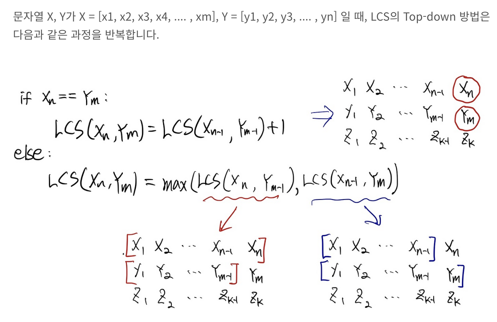
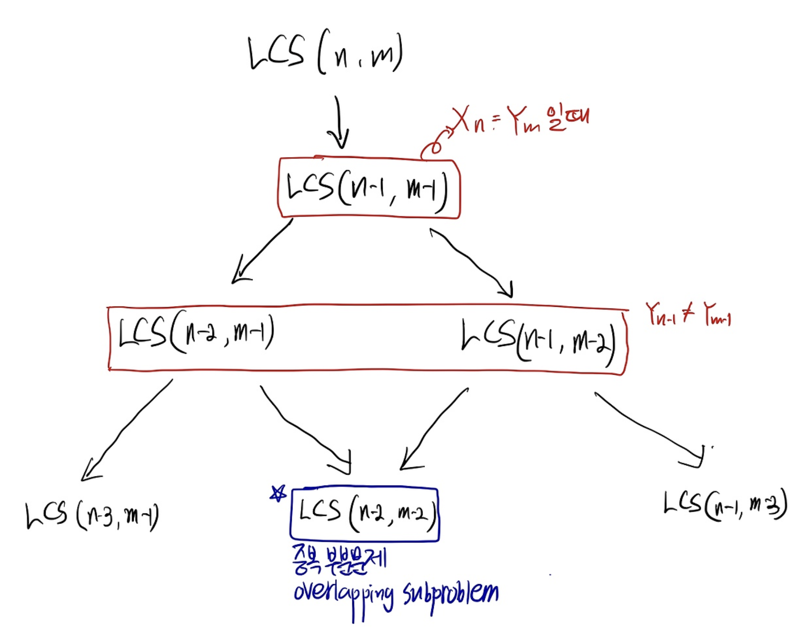
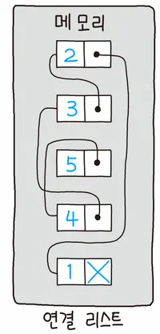

------------------------------------------------------------
# jungle_study
------------------------------------------------------------
### 4주차 공부 README
* 교재에 대한 공부와 공부 키워드에 따른 공부를 작성합니다.
------------------------------------------------------------
## 4주차 범위: 3장. 프로그램의 기계 수준 표현

### 책읽기

* 3.1 역사적 관점
    - x86이라고 통칭하는 인텔 프로세서 제품군은 오랜 기간 진화를 통한 개발을  해 왔다.
    - 8086 (91978, 29 K 트랜지스터). 최초의 단일 칩 16비트 마이크로프로세서. 8086의 변형인 8088은 8비트 외부 버스를 가지며, 원조 IBM 개인 컴퓨터의 핵심으로 이용됨.
    - 1980년에 인텔은 8087 부동소수점 보조 프로세서(45 K 트랜지스터)를 개발하여 8086이나 8088과 함께 사용하며 부동 소수점 인스트럭션을 실행.
    - 8087은 x86 제품군을 위한 부동소수점 모델을 정립하였으며, "x87"이라고 불림.
    - 각각의 인접한 프로세서는 이전 버전과 호환성을 갖도록 설계되었다. 이전의 모드 버전을 위해 컴파일한 코드가 모두 샐행 가능. / 인스트럭션 집합에는 이러한 진화적인 유산 떄문에 많은 이상한 잔재기능들이 존재한다고 함.

* 3.2 프로그램의 인코딩
    - Moore의 법칙
        - 매 26개월마다 트랜지스터의 수가 두 배가 되었다고 한다. 이러한 성장은 x86 마이크로프로세서의 수십 년간의 역사에서 유지되었다고 함. 
        - 당시 칩 기술로부터 외삽하여 칩당 트랜지스터의 수가 향후 10년간 매년 두 배씩 증가하리라는 것을 예측하였는데, 이 예측을 Moore의 법칙이라고 함.
        - 이후, 그의 예측은 다소 낙관적이었으나 또한 근시안적이기도 헀다고 함.
        - 유사한 지수 가가율이 자기디스크와 반도체 메모리를 포함하는 컴퓨터 관련 다른 측면에서도 일어남. 이와 같은 주목할 만한 성장률은 컴퓨터 혁명에 있어서 중요한 원동력이 되었다고 함.
    
    - 커맨드 라인 옵션으로 -Og1을 주면 컴파일러는 본래 C 코드의 전체 구조를 따르는 기계어 코드를 생성하는 최적화 수준을 적용. 하지만 일반적으로 최적화 수준을 올리게 되면...
        - 최종 프로그램은 더 빨리 동작하게 된다.
        - 컴파일 시간이 증가.
        - 디버깅 도구를 실행하기가 어려워질 위험이 있음.

        - 높은 수준의 최적화를 적용하면 만들어진 코드가 너무 많이 변경되어서 본래의 코드와 생성된 기계어 코드 간의 관계를 이해하기가 어렵다.

* 3.2.1 기계수준 코드
    - 컴퓨터 시스템은 보다 간단한 추상화 모델을 이용해서 세부 구현내용을 감추면서 추상화의 여러 가지 다른 형태를 사용하고 있다.
        - 1) 기계수준 프로그램의 형식과 동작은 *인스트럭션 집합구조*, 즉 "ISA"에 의해 정의됨.
            - 이 ISA는 프로세서의 상태, 인스트럭션의 형식, 프로세서 상태에 대한 각 인스트럭션으의 영향들을 정의. 프로세서 하드웨어는 훨씬 더 정교해서 여러 인스트럭션을 동시에 실행하지만, ISA에 의한 순차적 동작과 일치하는 전체 동작을 보이도록 해주는 안전장치를 사용.
        - 2) 기계수준 프로그램이 사용하는 주소는 *가상주소*이며, 메모리가 매우 큰 바이트 배열인 것처럼 보이게 는는 메모리 모델을 제공. 실제 메모리 시스템은 여러 개의 메모리 하드웨어와 운영체제 소프트웨어로 구현되어 있음.
    
    - 컴파일러는 전체 컴파일 순서에서 C에서 제공하는 추상화된 실행모델로 표햔된 프로그램을 프로세서가 실행하는 매우 기초적인 인스트럭션들로 변환하는 대부분의 일을 수행. (어셈블리 코드 표ㅗ현은 기계어 코드와 매우 유사하다.) --> 주요 특징은 바이너리 기계어 코드 형식과 비교할 때 더 읽기 쉬운 텍스트 형식이라는 것이다.
        - 프로그램 카운터(일반적으로 PC라고 하며, x86-64에서는 %rip라고 함.)는 실행할 다음 인스트럭션의 메모리 주소를 가리킨다.
        - 정수 레지스터 파일: 64비트 값을 저장하기 위한 16개의 이름을 붙인 위를를 갖는다. 이들 레지스터는 주소(C언어의 포인터에 해당하는)나 정수 데이를를 저장할 수 있다. 일부 레지스터는 프로그램의 중요한 상태를 추적하는 데 사용할 수 있으며, 다른 레지스터들은 함수의 리턴 값뿐만 아니라 프로시저의 지역변수와 인자 같은 임시 값을 저장하는 데 사용.
        - 조건 코드 레지스터: 가장 최근에 실행한 산술 또는 논리 인스트럭션에 관한 상태 정보를 저장. 이들은 if나 while문을 구현할 때 필요한 제어나 조건에 따른 데이터 흐름의 변경을 구현하기 위해 사용됨.
        - 백터 레지스터들의 집합은 하나 이상의 정수나 부동소수점 값들을 각각 저장할 수 있다.

* 3.2.2 코드 예제
    - *역어셈블러*: 기계어 코드로부터 어셈리리어 코드와 유사한 형태를 생성한다. / 기계어 코드 파일의 바이트 순서에만 전적으로 의존해서 어셈블러 코드를 결정. 소스 코드나 프로그램의 어셈블리 코드 버전을 사용하지 않는다. 인스트럭션의 형식은 주어진 시작 위치에서부터 바이트들을 기계어 인스트럭션으로 유일하게 디코딩할 수 있도로 설계한다. pushq %rbx 인스트럭션만 이 바이트 값 53으로 시도될 수 있다.

* 3.2.2 형식에 대한 설명
    - 어떤 응용 프로그램에서 프로그래머는 머신의 저수준 접근을 하기 위해 어셈블리 코드까지 내려가야 한다.
        - 1) 전체 함수를 어셈블리 코드로 작성하고 이들을 링크단계에서 C 함수들과 통합하는 것.
        - 2) GCC의 어셈블리 코드를 C 프로그램에 직접 추가하는 지원기능을 이용하는 것.

* 3.3 데이터의 형식
    - 인텔 프로세서들이 근본적으로 16비트 구조를 사용하다가 추후에 32비트로 확장했기 때문에 인텔은 "워드"라는 단어를 16비트 데이터 타입을 말할 때 사용. 이것에 기초해서 32비트의 양을 "더블워드"라고 부르고, 64비트의 양을 "쿼드워드"라고 부른다.

    - GCC가 생성한 대부분의 어셈블리 코드 인스트럭션들은 오퍼랜드의 크기를 나타내는 단일문자 접미어를 가지고 있다. 예를 들어, 데이터 이동 인스트럭션에는 네 개의 유형이 존재한다: movb(바이트 이동), movw(워드 이동), movl(더블워드 이동), movq(쿼드워드 이동).

* 3.4 정보 접근하기
    - x86-64 주처리장치 cpu는 64비트 값을 저장할 수 있는 16개의 범용 레지스터를 보유하고 있다. 이들 레지스터는 정수 데이터와 포인터를 저장하는데 사용.
    - 16비트 연산들은 가장 덜 중요한 2바이트에 접근하고, 32비트 연산은 덜 중요한 4바이트에, 64비트 연산은 레지스터 전체에 접근할 수 있다.
    - 정수 레지스터: 전체 16개 레지스터의 하위바이트들은 바이트, 워드(16비트), 더블워드(32비트), 쿼드워드(64비트) 씩 접근할 수 있다. + 형 변환을 통한 접근도 가능!

* 3.4.1 오퍼랜드 식별자
    - 대부분의 인스트럭션은 하나 이상의; 오퍼랜드를 가짐.
    - 오퍼랜드: 연산을 수행할 소스 값과 그 결과를 저장할 목적지의 위치를 명시한다. 소스 값은 상수로 주어지거나 레지스터나 메모리로부터 읽을 수 있다. 결과 값은 레제스터나 메모리에 저장된다. 그래서 여러가지 오퍼랜드의 종류는 세 가지 타입으로 구분할 수 있는데..
        - 1) immediate: 상수 값 / 서로 다른 인스트럭션들은 다양한 범위의 상수 값을 사용할 수 있다. 어셈블러는 해당 값을 인코딩하는 가장 컴팩트한 방법을 자동으로 선하하게 된다.
        - 2) register: 리제스터의 내용 / 각각 16개의 64비트, 32비트, 16비트, 8비트 레지스터으의 하위 일부분인 8, 4, 2, 1 바이트 중 하나의 레지스터를 가리킴.
        - 3) 메모리 참조(유효 주소): 계산된 주소에 의해 메모리 위치에 접근하게 됨.

------------------------------------------------------------
## 4주차 범위: 동적 프로그래밍, 그리디 알고리즘

### 공부 키워드

연습 문제 : [Practice_py](Practice_py)

* 다이나믹 프로그래밍
    - 큰 문제를 작은 문제로 나누어 푸는 방법론.
        - 작은 문제들의 해답을 이용해 큰 문제의 해답을 찾느 과정에서 효율적인 메모리 사용과 계산 속도 향상을 목표로 함.

    - 다이나믹 프로그래밍의 기본 원리(속성)
        - 최적 부분 구조 (Optimal Substructure)
            - 문제를 작은 하위 문제들로 나누고, 이 하위 문제들의 해답을 이용하여 원래 문제의 해답을 도출할 수 있는 속성.
                -  Ex) 피보나치 수열의 경우, F(n) = F(n-1) + F(n-2)와 같이 작은 문제들의 해답을 이용해 큰 문제의 해답을 구할 수 있습니다.

        - 중복되는 부분 문제 (Overlapping Subproblems)
            - 문제를 풀기 위해 동일한 하위 문제를 여러 번 풀어야 하는 경우.
                - Ex) 피보나치 수열에서는 F(n-1)과 F(n-2)를 계산하기 위해 F(n-2)와 F(n-3)을 반복적으로 계산해야 합니다.

    - 다이나믹 프로그래밍의 구현 방식
        - 탑다운(메모이제이션, Memoization) 방식
            - 재귀 함수와 메모이제이션을 이용하여 구현.
            - 이미 계산된 결과를 저장해 두고 필요할 때마다 재사용하여 중복 계산을 방지함.

        - 바텀업(Bottom-Up) 방식
            - 반복문을 이용하여 작은 문제부터 차근차근 해결해 나감.
            - 메모이제이션 없이, 작은 문제의 해답을 순차적으로 계산하여 최종 해답에 도달.

    - 예시 코드
        - 피보나치 수열
            - [ex_Pibo.py](ex_Pibo.py)

        - 최소 동전 거스름돈 문제
            - [find_min_coin.py](find_min_coin.py)

    - 활용
        - 경로 찾기 문제: *미로 문제*나 *최단 경로 문제* 등에서 DP를 활용해, 최적의 경로를 찾을 수 있다.
        - 문자열 처리 문제: *편집 거리 문제*나 *가장 긴 공통 부분 수열 문제* 등에서 DP를 사용하며 효율적으로 문제를 해결할 수 있다.
        - 배낭 문제: *한정된 무게 안에서 최대 가치를 얻는 문제* 등에서 DP를 사용하여 최적의 해답을 도출할 수 있음.

    - 주의사항
        - 1. 문제를 이해하고 작은 문제로 나누기
            - 문제를 작은 단위로 나누고, 이 작은 문제들이 어떻게 큰 문제를 해결하는지 파악해야함.
        - 2. 메모이제이션과 바텀업 방식 선택
            - 문제의 특성과 요구 사항에 따라 메모이제이션(탑다운) 방식이나 바텀업 방식을 선택하여 구현.
        - 3. 적절한 자료 구조 사용
            - DP 테이블으 구현할 때, 문제에 따라 리스트, 딕셔너리 등 적절한 자료 구조를 선택하여 사용.

* 그리디 알고리즘
    - 단순하지만 강력한 문제 해결 방법. 어떠한 문제를 해결할 때 현재 상황에서 가장 최적이라고 생각되는 선택을 반복적으로 하는 방식의 알고리즘. 즉, 각 단계에서 초선의 선택을 함으로써 전체 문제의 최적해를 구하려는 접근법.

        - 선택의 순간에 후속 결과를 고려하지 않고, 국소 최적 (Local Optimal)을 추구. 이러한 특성으로 인해 모든 문제에 적응할 수 있는 것은 아니지만, 특정 조으을 만족하는 문제에서는 매우 효율적으로 작동.

        - *사전에 외우고 있지 않아도 풀 수 있을 가능성이 높은 문제 유형*
            - 최단경로 기반의 알고리즘(다익스트라) 경우도 그리디 기반의 알고리즘이지만 어느정도 개념을 암기를 해야하는 경우도 있다하고 함.

        - 기준에 따라 좋은 것을 선택하는 알고리즘이므로 문제에서 '가장 큰 순서대로', '가장 작은 순서대로'와 같은 기준을 알게 모르게 제시하는 경우! 대체로 이 기준은 정렬 알고리즘을 사해했을 때 만족시킬 수 있으므로 *그리디 알고리즘 문제는 자주 정렬 알고리즘과 짝을 이뤄 출제됨.*

    - 원리
        - 한번 선택한 결과는 음음 선택에 어떠한 영향도 미치치 않아야 한다. 각 단계마다 최선의 선택이 이루어지면 그걸로 끝이므로 이전 결과를 들여다볼 필요가 없으며, 이런 방식으로 최적의 해결책을 찾을 수 있다면 *탐욕 알고리즘*을 사용해서 문제를 풀 수 있다.

        - 탐욕적 선택 속성
            - 한 번 선택한 결과는 다음 선택에 어떠한 영향도 미치지 않아야 한다. 각 단계마다 최선의 선택이 이루어지면 그걸로 끝이므로 이전 결과를 들여다볼 필요가 없으며, 이런 방식으로 최적의 해결책을 찾을 수 있다면 탐욕 알고리즘을 사용해서 문제를 풀 수 있음.

        - 최적 부분 구조
            - 문제의 최적해가 부분 문제들의 최적해로 구도될 수 있음을 의미한다. 이는 동적 계획법과 유사한 개념이지만, 그리디 알고리즘은 부분 문제의 최적해를 재사용하지 않고 각 단계에서 독립적으로 최적 선택을 함. 
            - --> 동적 프로그래밍은 작은 문제가 주어졌을 때 특정 계산법을 사용해서 최적의 정답을 이끌어내는 원리를 큰 문제에서도 활용하는 것이고, 탐욕 알고리즘은 작은 문제든 큰 문제든 항상 일관적으로 '최선의 경우'만을 선택해서 최적의 정답을 이끌어낸다고 이해하면 된다.

    - 그리디 알고리즘의 예제
        - 다양한 문제들에 적용될 수 있지만, *동전 거스름돈 문제, 활동 선택 문제, 허프만 코딩* 등이 대표적.

    - 정당성
        - 그리디 알고리즘이 모든 알고리즘 문제에 적용할 수 있는 것은 아니지만, 탐욕적으로 문제에 접근했을 때 정확한 답을 찾을 수 있다는 보장이 있는 알고리즘 문제라면, 매우 효과적.
        - -> 문제 이이를 위한 최소한의 아이디어를 떠올리고 이것이 정당한지 검토할 수 있어야, 답을 도출할 수 있음.

    - 장점
        - 간단하고 직관적! : 구현이 비교적 쉽고, 문제를 단계별로 접근할 수 있다.
        - 효율적! : 대부분의 경우 시간 복잡도가 낮아 빠르게 결과를 도출할 수 있다.

    - 단점
        - 항상 최적해를 보장하지 않음! : 그리디 선택이 전체 최적해로 이어지지 않는 경우가 있다.
        - 문제에 따라 적용 어려움! : 그리디 선택 속성과 최적 부분 구조를 만족는는 문제가 제한적.

    - 사용할 수 있는 문제 유형
        - 최소/최대 비용 문제: 최소 비용으로 특정 목표를 달성하거나, 최대 이익을 추구할 때.
        - 배낭 문제 (일부, 분수 배낭 문제): 물건을 배낭에 담을 때 가치 대비 무게가 높은 순으로 선택
        - 그래프 알고리즘: 크루스칼의 최소 신장 트리, 다익스트라의 최단 경로 등.

    - 다른 알고리즘과의 차이점
        - 그리디 알고리즘: 현재 단계에서 최적의 선택을 함으로써 전체 문제의 최적해를 추구.
            
        - 동적 계획법: 문제를 작은 부분 문제로 나어 어각 부분 문제의 최적해를 구하고, 이를 조합하여 전체 문제의 최적해를 도출.

            - *적용범위(동적 계획법 > 그리디 알고리즘)*
            - 동적 계획법은 더 일반적으로 적용할 수 있으며, 그리디 알고리즘에서 적도되지 않는 문제에서도 사용할 수 있다.
            - 그리디 알고리즘은 간단하고 빠르기 때문에, 그리디 선택 속성과 최적 부분 구조가 총족되는 경우 더 선호됨.

        - 분할 정복
            - 문제를 여러 부분으로 나누어 해결하는 점에서 유사하지만, 그리디 알고리즘은 각 단계에서 최적 선택을 하는 반면, 분할 정복은 문제를 분할하고 각 분할된 문제를 해결한 후 결합하여 전체 문제를 해결.

    - 실제 응용 사례
        - 네트워크 라우팅: 데이터 패킷을 네트워크 상에서 효율적으로 전달하기 위해 그리디 알고리즘이 사용됨. 최단 경로를 찾는 다익스트라 알고리즘 역시 그리디의 일종이라고 함.

        - 일정 관리: 일정 관리에서 최대한 많은 활동을 선택하거나, 회의실 배정을 최적화하는 문제에 그리디 알고리즘이 적용됨.

        - 허프만 코딩: 데이터 압축에서 허프만 코딩은 그리디 알고리즘을 이용하여 빈도가 높은 문자에 짧은 코드를 할당함으로써 전체 데이터의 크기를 줄임.

* LCS (Longest Common Subsequence)
    - 2개 이상의 문자열에서 공통으로 나타나는 부분 문자열 중 가장 긴 문자열을 의미.
    - LCS는 대표적으로 DNA의 공통 염기서열을 찾아 데이터를 압축하거나 무선 서명을 통해 휴대폰에서 사용자를 인증할 때 사용됨.
    
    - 예시
        - 두 문자열 X, Y가 다음과 같이 주어질 때, LCS(X, Y)는 다음과 같다.
        - X: ACAYKP, Y: CAPCAK
        - LCS(X, Y) = 4

    - Top-down 방법(재귀적 풀이)
        - 
        - [LCS.py](LCS.py)

        - LCS에서의 중복 부분 문제
            - 
            - LCS에서 하나의 값을 여려 번 호출하기 때문에 중도되는 부분 문제가 발생.
            - 그래서 재쉬적으로 LCS를 해결할 경우 O(2^n)이라는 시간복잡도를 가지게 됨.

    - Bottom-up 방법 (동적계획법 풀이)
        - Top-down 방식과 반대로 하여 중복 부분 문제는 한번만 계산하도록 바꿔 시간복잡도를 낮춤.
        - DP 테이블을 이용하여 미리 계산한 값을 저장.
        - DP테이블을 저장하는 방법은 같은 문자가 나오면 왼쪽 대각선 값에 1을 더해준 값을 넣어준다.
        - 다를 경우 위쪽이나 왼쪽 값중 더 큰 값을 지정.
        - 이렇게 DP 테이블을 채우는 이유: 재귀적 풀이를 이해하면 금방 이해할 수 있음.
        - 
        - [Bottom_up.py](Bottom_up.py)

    - LCS 문자열을 찾는 방법
        - 별도의 테이블을 구성하여 dp가 어디서 왔는지 기록.
        - 만약 왼쪽 대각선에서 왔다면 1, 위쪽에서 왔으면 2, 왼쪽에서 왔으면 3을 저장하여 1일 때만 문자를 추가.
        - [Find_LCS.py](Find_LCS.py)

* Knapsack Problem
    - 배낭 문제라고 불린다.
    - n개의 아이템이 각각의 무게 (weight) 그리고 가치(value)와 함께 주어짐
    - 가방은 최대 W만큼의 무게만 담을 수 있다고 가정할 때,
    - 가방의 무게를 넘지 않으면서 최대의 가치로 아이템을 구성하는 문제
    - 부르트 포스 방식은 모든 부분집합을 구해 조건을 만족하는 구성 중 가장 최대의 가치를 찾는 것.

    - [Knapsack_Problem.py](Knapsack_Problem.py)

* Linked List
    - 다른 추상 자료형(Abstract Data Type)을 구현할 때 기반이 되는 기초 선형 자료구조이다.
    - 각 노드가 데이터와 포인터를 가지고 한 줄로 연결되어 있는 방식으로 데이터를 저장한다.
    - 연결리스트의 두드러지는 특징들을 배열과 비교해서 보면 좋다.
    - 

    - 배열 vs 연결리스트
        - 배열은 물리적인 메모리 주소가 연속적이고, 연결리스트는 물리 메모리 주소가 연속적이지 않고 랜덤이다.
        - 배열은 삽입/삭제가 O(n)의 시간이 걸리지만, 동적으로 언결된 연결리스트는 삽입/삭제에 O(1)이 걸린다.
        - 배열은 각 원소에 인덱스로 O(1)의 시간으로 손쉽게 접근이 가능하다. 그러나 연결리스트 O(n)의 시간이 소요된다. (배열과 다르게 연결된 메모리가 아니기 때문에, 데이터를 찾기 위해서는 모든 노드를 거쳐서 탐색해야 한다.)

    - 연결리스트 종류
        - 싱글 연결리스트(Singly Linked List)
            - 자료구조에 대한 구현보다는 간단하게 연결 가능한 노드만 정의해서 노드를 가지고 연결리스트의 동작을 살펴보려 한다.
            - [Single_List.py](Single_List.py)
            
        - 더블 연결리스트(Doubly Linked List)
        - 원형 연결리스트(Circular Linked List)

* 포인터(pointer), & 연산자와 * 연산자
    - 포인터 * 연산자
        - * 는 산술 연산자에서는 곱셈을 의미하지만 포인터에서는 포인터 변수 주소 값에 있는 데이터를 말한다.
        - * 를 사용하여 출력을 했을 경우 값이 나오는 걸 확인할 수 있다.
        - * 를 사용하지 않아서 나오는 첫 번째 결과 값은 메모리 주소 값이다.
        - *p = 4; (*p 포인터 변수 주소 값에 있는 데이터에 4를 저장하라는 뜻)
    
    -  참조연산자 &
        - &&는 논리 연산자에서 AND를 수행하지만 참조연산자 &(&변수명)는 뒤에 있는 변수의 주소 값을 불러온다고 생각하면 됨.

------------------------------------------------------------

* 기본 알고리즘 틀

------------------------------------------------------------